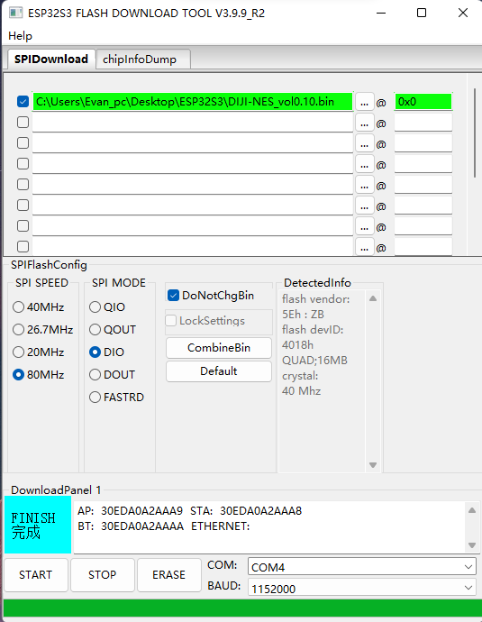

# GameBox 新手使用教程

## 先用一句话介绍这个项目

GameBox 是一个可以在 ESP32-S3 上运行红白机（NES）游戏的掌机系统。

我们的系统是在开源项目 **DIJI-NES** 基础上继续开发的。我们保留了原项目的
游戏模拟功能和原始硬件接线，同时重新整理了系统界面，增加了 LCDWIKI 开发板、
触摸操作、无线手柄、存档、倒带、联网管理、在线升级等功能。

因此：

- 已经按照原 DIJI-NES 接线制作的主机，不需要更换屏幕、按键、SD 卡或音频模块，
  直接烧录对应的优化版固件即可使用；
- 使用 LCDWIKI ES3C28P / ES3N28P 开发板的用户，可以使用专用固件；
- 两种主机都可以连接我们配套的 ESP32-C3 无线手柄；
- 不会写代码的用户也可以直接使用已经打包好的固件，不需要自己编译。

> 本项目是学习和交流项目。请只使用自己制作、合法获得或允许再分发的游戏 ROM。

---

## 1. 先确认你手里是什么设备

目前一共支持两种主机和一种无线手柄。

| 设备 | 怎么辨认 | 应该使用的首次烧录固件 |
| --- | --- | --- |
| 原版 DIJI-NES 主机 | 普通 ESP32-S3 开发板，外接 ST7789 屏幕、SPI SD 卡、MAX98357A 音频模块和 8 个按键，并且接线与原 DIJI-NES 一致 | `GameBox_esp32s3-n16r8_v0.6.1-dev_merged.bin` |
| LCDWIKI 主机 | LCDWIKI ES3C28P / ES3N28P，带 ILI9341 屏幕、触摸、板载 SD 卡槽和音频 | `GameBox_lcdwiki-es3c28p_v0.6.1-dev_merged.bin` |
| ESP32-C3 无线手柄 | 使用 ESP32-C3 开发板制作的 8 键无线手柄 | `GameBox_esp32c3-gamepad_v0.1.2_merged.bin` |

全部固件已经整理在：

- [三板固件总包](firmware/GameBox_3boards_20260720.zip)
- [固件文件说明](firmware/releases/GameBox_3boards_20260720/README.md)

### 特别提醒：普通 ESP32-S3 不等于原版 DIJI-NES 主机

原版固件兼容的是“原 DIJI-NES 的整套硬件接线”，不只是兼容一块裸的
ESP32-S3 开发板。如果屏幕型号或引脚接法不同，可能出现黑屏、按键无反应、
SD 卡不识别或没有声音。

如果你不确定自己的硬件是哪一种，先不要烧录，可以拍下开发板正反面、屏幕型号
和接线照片，再与上表确认。

### 1.1 三种设备和各模块的引脚接线表

下面的接线表与当前固件中的实际配置一致。表中的 `GPIO10`、`IO10` 和开发板上
印刷的数字 `10`，通常指的是同一个引脚。

#### 接线前先记住 5 件事

1. 接线和改线前先断开 USB、电池和其他电源；
2. 屏幕、SD 卡、音频模块、按键和开发板必须共地，也就是所有 `GND` 要连在一起；
3. ESP32 的 GPIO 是 3.3V 信号脚，不能把 5V 直接接到 GPIO；
4. 本项目的实体按键都使用内部上拉：按键一端接指定 GPIO，另一端接 `GND`，
   不需要再给每个按键增加上拉电阻；
5. 外接模块的 `VCC` 应按模块本身标注的电压供电。不同模块的电源设计可能不同，
   不确定时先查模块说明，不要仅凭外观猜测。

按键的统一接法如下：

```text
指定 GPIO ─── 按键 ─── GND
```

按下按键时，GPIO 与 GND 接通，系统就会识别为按键按下。

#### 设备一：原版 DIJI-NES ESP32-S3 主机

这套接线适用于文件名中带有 `esp32s3-n16r8` 的主机固件。

**ST7789 屏幕模块**

| ST7789 上的标识 | 接 ESP32-S3 | 说明 |
| --- | --- | --- |
| `CS` | GPIO10 | 屏幕片选 |
| `DC` / `RS` | GPIO11 | 数据和命令选择 |
| `RST` / `RES` | GPIO12 | 屏幕复位 |
| `SCL` / `SCK` / `CLK` | GPIO14 | 屏幕时钟 |
| `SDA` / `MOSI` / `DIN` | GPIO13 | ESP32-S3 向屏幕发送画面数据 |
| `MISO` / `SDO` | 不接 | 当前原版屏幕配置不使用 |
| `BL` / `LED` | 按屏幕模块要求接电源 | 当前固件没有单独控制原版屏幕背光 |
| `VCC` | 按模块标注供电 | 不要接到普通 GPIO |
| `GND` | GND | 必须与主板共地 |

同一种功能在不同屏幕模块上可能印成不同名称，例如 `SCL`、`SCK` 和 `CLK` 都表示
时钟。接线时看功能，不要只看名称是否完全相同。

**SPI MicroSD 卡模块**

| SD 卡模块上的标识 | 接 ESP32-S3 | 说明 |
| --- | --- | --- |
| `CS` | GPIO42 | SD 卡片选 |
| `SCK` / `CLK` | GPIO40 | 时钟 |
| `MISO` / `DO` | GPIO39 | SD 卡向主机发送数据 |
| `MOSI` / `DI` | GPIO41 | 主机向 SD 卡发送数据 |
| `VCC` | 按模块标注供电 | 应使用兼容 3.3V 信号的模块 |
| `GND` | GND | 必须与主板共地 |

**MAX98357A 音频功放模块**

| MAX98357A 上的标识 | 接 ESP32-S3 | 说明 |
| --- | --- | --- |
| `BCLK` / `BCK` | GPIO5 | 音频时钟 |
| `LRC` / `LRCLK` / `WS` | GPIO4 | 左右声道时钟 |
| `DIN` | GPIO6 | 音频数据 |
| `VIN` | 按模块标注供电 | 不要接到普通 GPIO |
| `GND` | GND | 必须与主板共地 |
| `SPK+`、`SPK-` | 接喇叭两端 | 喇叭两端都接功放，不要把 `SPK-` 当作 GND |

`SD`、`GAIN` 等其他脚保持模块默认状态即可，当前固件不需要把它们接到 GPIO。

**8 个实体按键**

| 按键 | 接 ESP32-S3 | 按键另一端 |
| --- | --- | --- |
| A | GPIO48 | GND |
| B | GPIO47 | GND |
| SELECT（选择） | GPIO16 | GND |
| START（开始） | GPIO15 | GND |
| UP（上） | GPIO17 | GND |
| DOWN（下） | GPIO3 | GND |
| LEFT（左） | GPIO8 | GND |
| RIGHT（右） | GPIO18 | GND |

#### 设备二：LCDWIKI ES3C28P / ES3N28P 主机

LCDWIKI 板的屏幕、触摸、SD 卡槽和音频电路已经焊接在板上。普通用户只需要插卡、
接喇叭并烧录专用固件，**不要再按照原版 DIJI-NES 的表格给这些模块重复接线**。

下面这张表主要用于检查板型、维修或自己设计兼容硬件：

| 板载模块 | 信号与 GPIO | 普通用户需要做什么 |
| --- | --- | --- |
| ILI9341 屏幕 | `CS=GPIO10`、`DC=GPIO46`、`SCLK=GPIO12`、`MOSI=GPIO11`、`MISO=GPIO13`、`BL=GPIO45` | 已在板内连接，无需接线 |
| 屏幕复位 | 与主板 `CHIP_PU` 相连 | 已在板内连接，无需接线 |
| MicroSD 卡槽 | `CLK=GPIO38`、`CMD=GPIO40`、`D0=GPIO39`、`D1=GPIO41`、`D2=GPIO48`、`D3=GPIO47` | 直接把 MicroSD 卡插入板载卡槽 |
| FT6336 触摸 | `SDA=GPIO16`、`SCL=GPIO15`、`INT=GPIO17`、`RST=GPIO18` | 已在板内连接，无需接线 |
| ES8311 音频控制 | `SDA=GPIO16`、`SCL=GPIO15` | 与触摸共用板载通信线，无需接线 |
| ES8311 音频数据 | `MCLK=GPIO4`、`BCLK=GPIO5`、`LRCLK=GPIO7`、`DOUT=GPIO8`、`DIN=GPIO6` | 已在板内连接，无需接线 |
| SC8002 功放使能 | GPIO1，低电平开启 | 已在板内连接，无需接线 |
| 喇叭 | 板上的喇叭输出接口 | 按板上接口标识连接合适的喇叭 |

这里的 `DOUT=GPIO8` 是 ESP32-S3 向音频芯片发送声音，`DIN=GPIO6` 是音频芯片
向 ESP32-S3 输入数据。普通使用只需要知道它们已经在板内接好。

LCDWIKI 还预留了 4 个可以外接按键的 GPIO：

| 外接按键 | 接 LCDWIKI 扩展 GPIO | 按键另一端 |
| --- | --- | --- |
| A | GPIO2 | GND |
| START（开始） | GPIO3 | GND |
| UP（上） | GPIO14 | GND |
| DOWN（下） | GPIO21 | GND |

这 4 个按键足够操作菜单和做基础测试。完整游戏操作可以直接使用屏幕触摸按键，
也可以连接 ESP32-C3 无线手柄，不需要再为 B、左、右和 SELECT 强行寻找空闲引脚。

#### 设备三：ESP32-C3 无线手柄

这套接线适用于文件名中带有 `esp32c3-gamepad` 的手柄固件。8 个按键仍然是一端
接 GPIO、另一端接 GND。

| 手柄功能 | 接 ESP32-C3 | 按键另一端 |
| --- | --- | --- |
| A | GPIO10 | GND |
| B | GPIO4 | GND |
| SELECT（选择） | GPIO5 | GND |
| START（开始） | GPIO6 | GND |
| UP（上） | GPIO0 | GND |
| DOWN（下） | GPIO1 | GND |
| LEFT（左） | GPIO3 | GND |
| RIGHT（右） | GPIO7 | GND |

**状态指示灯**

当前手柄固件使用 GPIO8，并按照“GPIO8 输出高电平时点亮”处理：

| LED 接法 | 说明 |
| --- | --- |
| 开发板已有 GPIO8 指示灯 | 不需要再接外部 LED |
| 自己外接 LED | GPIO8 → 限流电阻 → LED 正极，LED 负极 → GND |

外接 LED 必须串联限流电阻，不能把 LED 直接跨接在 GPIO8 和 GND 之间。如果你的
ESP32-C3 开发板没有 GPIO8 指示灯，也不影响按键和无线手柄功能，只是看不到状态灯。

**供电、电量检测和震动**

- 调试时最简单的方式是通过 ESP32-C3 开发板的 USB 接口供电；
- 锂电池不能直接接普通 GPIO，也不要在没有充电和稳压电路时直接接开发板；
- 当前打包固件没有启用电池电量检测引脚；
- 当前打包固件没有启用震动马达引脚，马达也不能由 GPIO 直接驱动；
- GPIO2、GPIO8、GPIO9 与 ESP32-C3 的启动状态有关，不要随意改成按键接线。

默认接线下，手柄休眠后可以用 UP、DOWN、LEFT、B 或 SELECT 唤醒。A、START 和
RIGHT 可以正常玩游戏，但不能从深度休眠中唤醒手柄。

---

## 2. 我们在原 DIJI-NES 上做了哪些更新

下面只介绍用户能够直接感受到的变化。

### 2.1 原版硬件继续可用

我们没有放弃原 DIJI-NES 的硬件。原来的 ST7789 屏幕、SD 卡、音频模块和
8 个实体按键都保留支持。

原版用户只需要选择文件名中带有 `esp32s3-n16r8` 的固件，就可以使用新版系统。
原版主机和 LCDWIKI 主机现在统一显示 `0.6.1-dev` 版本，方便统一管理；后台仍会
区分两种硬件，不会把另一块板的固件错误推送过来。

### 2.2 新增 LCDWIKI ES3C28P / ES3N28P 支持

新版系统增加了 LCDWIKI 专用配置，可以使用这块板自带的：

- 彩色屏幕；
- 电容触摸；
- MicroSD 卡槽；
- 音频芯片和喇叭输出；
- 扩展接口上的实体按键。

LCDWIKI 用户不需要照着原项目重新连接屏幕和音频模块，烧录专用固件即可。

### 2.3 新增 ESP32-C3 无线手柄

主机最多可以连接两个无线手柄，分别作为 P1 和 P2：

- 在系统界面中，P1、P2 都可以操作菜单；
- 进入游戏后，P1 控制一号玩家，P2 控制二号玩家；
- 手柄可以显示在线状态和大致延迟；
- 一段时间不用会自动休眠，按支持唤醒的按键即可重新连接；
- 手柄固件也可以通过主机接收在线升级。

原版主机的 8 个实体按键仍然可以使用。无线手柄是新增选择，不是强制要求。

### 2.4 系统界面更适合普通用户

原项目以运行游戏为主，新版增加了更完整的掌机界面：

- 壁纸时钟主页；
- 游戏列表和封面；
- 统一的系统设置；
- 清晰的底部操作栏；
- 触摸、实体按键和无线手柄都能操作菜单；
- 危险操作会再次确认，而且默认停在“取消”，减少误删除和误格式化。

### 2.5 游戏显示和兼容性优化

我们修复和改善了多种常见问题，例如：

- 部分游戏人物闪烁或消失；
- 横向卷轴游戏边缘出现花屏或接缝；
- 复杂画面下可能卡顿或触发重启；
- 部分游戏卡带格式读取不正确；
- 损坏或暂不支持的游戏直接卡死。

现在遇到无法识别或暂不支持的游戏时，系统会尽量给出提示并返回菜单。大部分常见
NES 游戏可以正常运行，但少量特殊版本、改版游戏或特殊卡带类型仍可能不兼容。

### 2.6 存档功能更完整

新版系统提供：

- 3 个手动存档槽；
- 自动保存最近游戏进度；
- 开机后继续上一次游戏；
- 存档缩略图；
- 游戏本身的电池存档；
- 断网时先保存在本地，联网后再同步云端；
- 存档损坏检查，避免坏文件覆盖正常进度。

### 2.7 增加游戏倒带

可以在设置中选择 5 秒、10 秒或 20 秒倒带。游戏中按住 `SELECT + 左`，就可以
回到几秒前，适合失误后快速重试。

### 2.8 加游戏和换壁纸更方便

除了把 SD 卡插到电脑中复制文件，新版还提供临时管理网页。手机或电脑打开网页后
可以：

- 上传、查看和删除 NES 游戏；
- 上传和裁切壁纸；
- 修改常用系统设置；
- 查看设备提供的管理地址。

退出系统设置后，临时网页会自动关闭。

### 2.9 增加联网功能

连接 2.4 GHz Wi-Fi 后，可以使用：

- 在线游戏商店；
- 云端存档；
- 主机在线升级；
- 无线手柄在线升级；
- 自动校准主页时间。

网络不可用时，本地游戏和本地存档仍然可以正常使用。

### 2.10 系统更安全、更稳定

新版对游戏、存档、下载文件和升级固件增加了检查。写入存档或下载游戏时会先使用
临时文件，成功后再替换正式文件，尽量减少断电或网络中断造成的数据损坏。

在线升级失败时，系统会尽量保留或返回上一个可以启动的版本。

---

## 3. 最简单的上手路线

如果你只想尽快开始游戏，可以按照下面 6 步操作：

1. 对照第 1 节确认自己的主机型号；
2. 从固件包中选择对应的 `_merged.bin`；
3. 使用乐鑫 Flash Download Tool，地址填写 `0x0` 完成首次烧录；
4. 准备一张 FAT32 格式的 MicroSD 卡，新建 `/rom` 文件夹；
5. 把有权使用的 `.nes` 游戏复制进 `/rom`；
6. 插卡开机，在游戏列表中选择游戏。

触摸、无线手柄、Wi-Fi、商店和云存档都可以以后再设置，不影响先玩本地游戏。

---

## 4. 第一次烧录主机固件

### 4.1 需要准备

- 一台 Windows 电脑；
- 一根确认可以传数据的 USB 线；
- 乐鑫 Flash Download Tool；
- 与硬件匹配的 `_merged.bin` 固件。

> 只用于充电的 USB 线不能烧录。如果电脑完全没有出现串口，优先换线测试。

### 4.2 选择正确芯片

- 原版 DIJI-NES 主机：选择 `ESP32-S3`；
- LCDWIKI ES3C28P / ES3N28P：选择 `ESP32-S3`；
- 无线手柄：选择 `ESP32-C3`。

### 4.3 添加固件

烧录页面只需要添加一个对应的 `_merged.bin` 文件，烧录地址填写：

```text
0x0
```



建议保留工具默认选项，并勾选 `DoNotChgBin`。选择正确串口后点击 `START`。

### 4.4 如果一直显示等待连接

1. 按住设备的 `BOOT` 键；
2. 短按一次 `RESET` 或 `EN`；
3. 松开 `BOOT`；
4. 再次点击 `START`。

### 4.5 烧录完成

等待工具显示 `FINISH`，然后按一下 `RESET`，或者断电后重新上电。

如果设备以前烧录过其他项目，建议先执行一次 `ERASE`，再重新烧录。擦除会清除
Wi-Fi、系统设置和手柄配对信息，但不会删除 SD 卡里的游戏和存档。

### 4.6 `_merged.bin` 和 `_ota.bin` 有什么区别

- `_merged.bin`：首次烧录、空白设备恢复或更换分区时使用，地址为 `0x0`；
- `_ota.bin`：只给在线升级后台使用，普通用户不要拿它首次烧录。

不要把两种文件混用。

---

## 5. 两种主机分别怎么使用

### 5.1 原版 DIJI-NES 主机

原版主机使用原来的 8 个实体按键，不需要触摸屏：

| 按键 | 在系统菜单中的作用 |
| --- | --- |
| 方向键 | 移动选择 |
| A | 确认、进入 |
| B | 返回、取消 |
| SELECT | 在页面内容和底部操作栏之间切换 |
| START | 快速确认或开始游戏 |

进入游戏后，这些按键恢复为标准 NES 手柄功能。

原版硬件没有 LCDWIKI 的触摸唤醒引脚，因此“触摸校准”会显示不可用，系统也不会
让设备进入无法唤醒的软件关机状态。这属于硬件差异，不影响正常游戏。

### 5.2 LCDWIKI ES3C28P / ES3N28P 主机

LCDWIKI 主机可以直接触摸屏幕操作：

- 点击“游戏”进入游戏列表；
- 点击“设置”进入系统设置；
- 有最近游戏时，可以点击“继续”；
- 游戏中可以使用屏幕上的虚拟按键；
- 长按触摸屏约 1.5 秒，可以唤醒已经软件关机的主机。

板子扩展接口上的 4 个实体按键可以完成部分菜单操作。要获得更完整、手感更好的
游戏操作，建议搭配 ESP32-C3 无线手柄。

---

## 6. 准备 SD 卡和游戏

建议使用质量可靠的 MicroSD 卡，并在电脑上格式化为 FAT32。

在卡中建立：

```text
/rom
/saves
/wallpapers
```

把 `.nes` 游戏放进 `/rom`。也可以在 `/rom` 里面继续建立分类文件夹，主机会
自动扫描。

建议在主机断电时插拔 SD 卡。开机后如果没有识别到，可以进入：

```text
设置 → SD 卡 → 重新检测
```

“格式化 SD 卡”会永久删除卡里的游戏、存档、壁纸和截图。确认页面默认选择取消，
但操作前仍要仔细检查。

---

## 7. 第一次开机和菜单操作

开机后会先显示启动画面，然后进入壁纸时钟主页或游戏列表。

主页通常有：

- `继续`：继续最近一次游戏；
- `游戏`：打开本地游戏列表；
- `设置`：打开系统设置。

游戏列表中：

- 上下选择游戏；
- 按 A 或 START 开始；
- 按 B 返回主页；
- 长按 B 可以删除当前游戏，但系统会再次确认；
- 按 SELECT 可以切换到底部操作栏，进入主页、设置、商店或关机功能。

---

## 8. 配对 ESP32-C3 无线手柄

### 8.1 先烧录手柄

选择：

```text
GameBox_esp32c3-gamepad_v0.1.2_merged.bin
```

Flash Download Tool 选择 `ESP32-C3`，烧录地址同样是 `0x0`。

### 8.2 开始配对

1. 主机进入“设置 → 游戏手柄”；
2. 选择 P1 或 P2；
3. 点击配对，或按 A 开始配对；
4. 在手柄上同时长按 `SELECT + START` 大约 1.5 秒；
5. 手柄蓝灯快速闪烁时，表示正在配对；
6. 主机显示“已配对、在线”后即可使用。

### 8.3 指示灯怎么看

| 指示灯状态 | 含义 |
| --- | --- |
| 慢闪 | 正在寻找已经配对的主机 |
| 快闪 | 正在配对 |
| 很慢轻闪 | 已连接，目前没有操作 |
| 常亮 | 已连接，正在按键 |

### 8.4 手柄休眠

手柄连续 5 分钟没有操作会自动休眠。按“上、下、左、B、SELECT”中的任意一个
可以唤醒当前接线的手柄。唤醒后通常会自动恢复连接，不需要重新配对。

无线手柄不能唤醒已经软件关机的主机，因为主机睡眠后无线功能也会停止。

---

## 9. 游戏中的常用操作

进入游戏后：

| 按键 | 功能 |
| --- | --- |
| 方向键 | 控制游戏方向 |
| A / B | NES 的 A / B 键 |
| START | 开始、暂停或确认，由游戏决定 |
| SELECT | 选择，由游戏决定 |
| START + SELECT | 打开 GameBox 暂停菜单 |

暂停菜单中可以继续游戏、保存、读取、调整音量或返回游戏列表。

### 保存和读取

1. 游戏中同时按 `START + SELECT`；
2. 选择“保存”或“读取”；
3. 用左右键选择槽 1、槽 2 或槽 3；
4. 按 A 或 START 确认；
5. 按 B 取消。

### 使用倒带

先在“设置 → 倒带时长”选择 5、10 或 20 秒。游戏中按住：

```text
SELECT + 左
```

即可向前倒回。倒带会占用一定内存，如果设备内存不足，系统可能提供比设置值更短的
实际倒带时间。

---

## 10. 连接 Wi-Fi

主机只能连接 2.4 GHz Wi-Fi。

1. 打开“设置 → WiFi 配网”；
2. 屏幕会显示一个类似 `GameBox-12AB34` 的临时热点；
3. 用手机连接这个热点；
4. 如果手机提示“无法访问互联网”，选择继续使用当前网络；
5. 浏览器打开屏幕显示的地址，通常是 `http://192.168.4.1`；
6. 选择家里的 2.4 GHz Wi-Fi，输入密码并提交；
7. 等待主机显示连接成功；
8. 返回系统设置。

主机可以保存多组 Wi-Fi。以后开机会优先尝试上次成功连接的网络。

---

## 11. 用手机或电脑管理游戏和壁纸

进入“设置”后，主机会启动临时设置网页。

1. 打开“设置 → 网页管理”；
2. 按屏幕提示连接主机热点，或让手机、电脑与主机处在同一个家庭网络；
3. 浏览器打开屏幕显示的地址；
4. 进入“ROM 管理”上传或删除游戏；
5. 进入“壁纸管理”上传、移动和裁切壁纸。

ROM 管理支持拖拽和多选上传。单个文件不能超过 8 MB，同名游戏不会自动覆盖。

退出整个系统设置后，临时网页会自动关闭。如果修改了游戏，主机会重新扫描游戏列表。

---

## 12. 游戏商店、云存档和在线升级

这些功能需要连接 Wi-Fi，并且项目服务端处于可用状态。

### 游戏商店

从游戏列表底部操作栏进入“商店”，选择游戏后按 A 或 START 下载。下载完成后，
游戏会出现在本地列表中。

### 云存档

本地存档永远优先保存在设备上。联网后，系统会把等待同步的存档上传到云端。

需要手动处理时，可以进入：

```text
设置 → 云端存档
```

选择“立即同步”或“从云端恢复”。从云端恢复前，设备需要至少启动过一次对应游戏，
以便确认游戏身份。

### 在线升级

1. 保持主机连接 Wi-Fi；
2. 打开“设置 → 系统更新”；
3. 选择“检查更新”；
4. 有新版本时选择安装；
5. 升级期间不要断电。

原版 S3 和 LCDWIKI S3 虽然版本号统一，但使用不同的更新通道。系统会检查硬件类型，
不会安装另一块板的固件。

---

## 13. 关机说明

### LCDWIKI 主机

可以在“设置 → 关机设置”中立即关机，也可以设置长时间无操作后自动关机。关机后
长按触摸屏约 1.5 秒重新启动。

### 原版 DIJI-NES 主机

原版硬件没有专用触摸唤醒信号。为了防止关机后无法再次启动，系统会自动关闭不安全的
软件关机选项。需要关机时请使用硬件电源开关或断开电源。

---

## 14. 常见问题

### 烧录成功，但主机黑屏

- 确认没有选错固件；
- 原版主机应使用 `esp32s3-n16r8`；
- LCDWIKI 主机应使用 `lcdwiki-es3c28p`；
- 确认烧录地址是 `0x0`；
- 先执行 ERASE，再重新烧录；
- 原版硬件还要确认屏幕型号和接线与原项目一致。

### SD 卡没有识别

- 使用 FAT32；
- 断电后重新插卡；
- 确认建立了 `/rom` 文件夹；
- 进入“设置 → SD 卡 → 重新检测”；
- 换一张容量较小、质量可靠的卡测试。

### 游戏没有出现在列表里

- 文件扩展名应为 `.nes`；
- 游戏应放在 SD 卡 `/rom` 目录；
- 退出系统设置，让主机重新扫描；
- 损坏、格式错误或暂不支持的游戏可能会被拒绝。

### 游戏能打开，但画面或声音异常

- 确认使用的是正确板型固件；
- 尝试其他来源可靠的 ROM；
- 少量特殊游戏仍可能存在兼容问题；
- 记录游戏名称、ROM 版本和现象，反馈给开发者排查。

### 手柄配对不上

- 主机必须停留在 P1/P2 配对页面；
- 同时按住 `SELECT + START` 满 1.5 秒；
- 看到快闪后再等待主机确认；
- 主机与手柄都尽量使用当前固件；
- 仍然失败时，清除旧配对后重新操作。

### Wi-Fi 一直连接失败

- 确认是 2.4 GHz 网络；
- 检查密码；
- 手机连接主机热点后不要自动切回移动数据；
- 把主机移到路由器附近；
- 重启主机后重新配网。

### 在线升级提示型号不匹配

不要强行安装。这通常表示后台选择了错误通道，或者设备烧录过另一块板型的固件。
重新确认硬件型号和当前固件文件名。

---

## 15. 新手使用检查表

第一次使用时，可以逐项确认：

- [ ] 已经确认主机是原版接线还是 LCDWIKI；
- [ ] 选择了文件名与主机一致的 `_merged.bin`；
- [ ] Flash Download Tool 的芯片类型选择正确；
- [ ] 烧录地址填写 `0x0`；
- [ ] SD 卡已经格式化为 FAT32；
- [ ] 游戏放在 `/rom` 文件夹；
- [ ] 主机能够正常显示、发声和进入游戏；
- [ ] 如需无线手柄，已经烧录 C3 固件并完成配对；
- [ ] 如需联网功能，已经连接 2.4 GHz Wi-Fi；
- [ ] 已经测试一次保存、读取和正常退出游戏。

完成以上项目后，就可以开始正常使用 GameBox。
