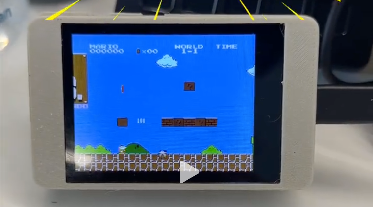
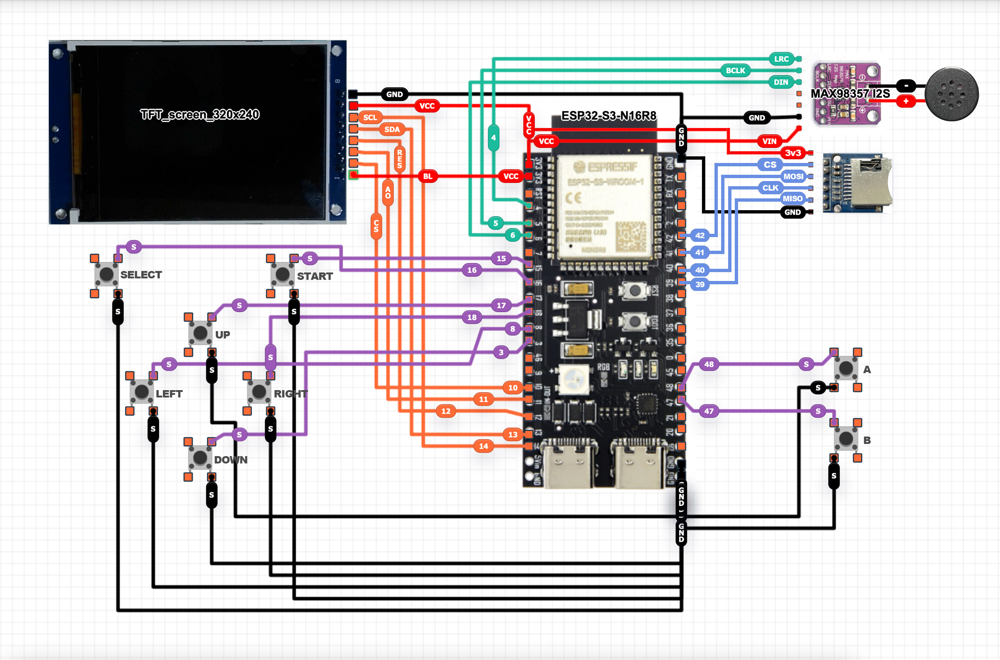

# GameBox-NES

<p align="center">
  
  
  
</p>

> ⚠️ **学习项目 / Learning Project**
>
> 这是一个用于学习 NES 模拟器原理和嵌入式系统编程的项目。部分功能仍在开发中。QQ交流群：34974022
>
> This is a learning project for understanding NES emulation and embedded systems programming. Some features are still under development.

<p align="center">
   
</p>

<p align="center">

</p>
---

ESP32-S3 上运行的 NES（任天堂红白机）模拟器，支持显示、音频和控制器。

A NES (Nintendo Entertainment System) emulator running on ESP32-S3 microcontroller with display, audio, and controller support.

## 开源范围

本仓库公开 GameBox 主机固件、ESP32-C3 无线手柄固件、硬件适配、测试和开发文档，采用 GPLv3 许可证。以下内容不属于公开仓库：

- 游戏商店、OTA、云存档、设备认证和统计服务的服务端实现与部署配置；
- 生产环境域名、账号、访问令牌、数据库、日志及对象存储配置；
- 商业游戏 ROM、封面，以及内部发布使用的预编译固件包。

客户端联网功能保留公开接口实现，但默认指向不可用的示例地址。需要连接自建服务时，请将 `src/service_config.local.h.example` 复制为 `src/service_config.local.h` 并填写自己的 HTTPS 服务地址；本地配置已被 Git 忽略。公开发布前的检查方法见 [开源发布清单](docs/OPEN_SOURCE_RELEASE.md)，安全问题请按 [安全策略](SECURITY.md) 私下报告。

第一次接触本项目、不需要查看开发细节的用户，请直接阅读：

- [GameBox 新手使用教程](GAMEBOX_BEGINNER_USER_GUIDE.md)

---

## ✨ 功能特性

- **完整 CPU 模拟** - 6502 CPU 全指令集 (~150 操作码)
- **PPU 图形** - 背景渲染、滚动、分屏效果、64 个精灵 (8×8 和 8×16 模式)
- **APU 音频** - 方波、三角波、噪声通道，通过 I2S DAC 输出
- **双核架构** - Core 0: 音频 + 显示, Core 1: 模拟
- **接近 60 FPS** - 大部分游戏约 57-61 FPS，重精灵场景约 55-58 FPS
- **Mapper 支持** - NROM, MMC1, UxROM, CNROM, MMC3, AxROM, GxROM
- **存档功能** - 3 个截图预览手动槽、自动续玩、游戏列表最近画面、ROM 身份保护和电池 SRAM `.srm`
- **云端存档** - 设备 ID 自动建立云空间，本地存档离线排队并在开机联网或进入联网功能时自动同步，支持原子恢复、冲突保护和 OSS 历史版本
- **Rewind 倒带** - PSRAM 完整快照与 XOR 差分环形缓冲，支持 5/10/20 秒配置
- **菜单系统** - ROM 浏览器、暂停菜单、无 SD 卡时提示界面
- **连续滚动列表** - 本地游戏和游戏商店使用离屏画布、惯性滑动和连续滚动，不再显示上一页/下一页
- **壁纸时钟主页** - 开机显示 DeskBox 风格的壁纸、时间和日期；可在设置中选择 SD 卡壁纸，并通过临时网页裁切上传 `320×240` JPEG
- **多种输入方式** - 实体按键、触摸控制、USB 串口键盘和 ESP-NOW 双手柄
- **多存储来源** - SD 卡、内置 LittleFS 和下载缓存；设置中可查看 SD 卡容量/占用状态、重新检测并经二次确认格式化
- **联网游戏商店** - 使用免密码的 `GameBox-MAC后6位` 热点配网，支持离线索引缓存和下载完整性校验
- **统一设置网页** - 进入系统设置即启动临时网页，可调整常用设备选项，并集中管理壁纸和 SD 卡 ROM；退出设置后自动关闭
- **游戏资源校验** - 客户端验证 HTTPS 地址、文件大小、SHA-256 和 ROM 文件头；服务端与资源内容不在本仓库中提供
- **设备设置** - iOS 风格的可滚动列表，集中管理配网、手柄、显示、音量、触摸、开机主页、壁纸、关机和系统更新
- **软件开关机** - 支持立即关机、无操作 5/10/20 分钟自动关机，以及长按屏幕唤醒
- **安全 OTA** - 固定设备 ID、HTTPS 检查更新、SHA-256 校验、双分区升级和失败回滚
- **友好失败提示** - 不支持的 Mapper 或异常 ROM 会提示后返回主菜单

## Features

- **Complete CPU emulation** - Full 6502 instruction set (~150 opcodes)
- **PPU graphics** - Background rendering, scrolling, split-screen effects, and 64 sprites (8x8 and 8x16)
- **APU audio** - Pulse, triangle, and noise channels through an I2S DAC
- **Dual-core architecture** - Core 0: audio + display, Core 1: emulation
- **Near 60 FPS** - Most games run around 57-61 FPS; object-heavy scenes are around 55-58 FPS
- **Mapper support** - NROM, MMC1, UxROM, CNROM, MMC3, AxROM, GxROM
- **Save states** - Three preview slots, auto-resume, recent-game library images, ROM identity checks, and battery-backed `.srm`
- **Rewind** - Configurable 5/10/20-second PSRAM ring using full snapshots and XOR deltas
- **Menu system** - ROM browser, pause menu, and no-SD-card prompt
- **Continuous lists** - Local games and the store use off-screen rendering and inertial scrolling without page buttons
- **Wallpaper clock home** - Boots into a DeskBox-inspired wallpaper, clock, and date; the Game button opens the ROM library
- **Multiple input methods** - Physical buttons, touch controls, USB serial keyboard, and two ESP-NOW gamepads
- **Multiple storage sources** - SD card, built-in LittleFS, and download cache, with SD status, remount, and confirmed formatting controls
- **Network game store** - Password-free `GameBox-<last 6 MAC digits>` provisioning AP, offline index cache, and download integrity verification
- **Device settings** - An iOS-style scrolling list for Wi-Fi, gamepads, display, volume, touch, startup page, shutdown, and updates
- **Software power control** - Immediate shutdown, 5/10/20-minute inactivity timers, and long-touch wake
- **Secure OTA** - Stable device ID, HTTPS update checks, SHA-256 validation, dual-slot updates, and rollback
- **Friendly failure messages** - Unsupported mappers or invalid ROMs show a message and return to the main menu

---

## 🎮 兼容性


| Mapper | 名称  | 状态                  |
| ------ | ----- | --------------------- |
| 0      | NROM  | ✅ 正常               |
| 1      | MMC1  | ✅ 正常               |
| 2      | UxROM | ✅ 正常               |
| 3      | CNROM | ✅ 正常               |
| 4      | MMC3  | ✅ 大部分正常         |
| 7      | AxROM | ⚠️ 待真机兼容性回归 |
| 66     | GxROM | ⚠️ 待真机兼容性回归 |

### 项目状态

本项目已支持 **NES 前期、中期及大部分后期游戏**，包括依赖 MMC3 扫描线 IRQ 的游戏（如超级马里奥 3）。

少数非标准时序、特殊 mapper 或盗版/改版 mapper 变体的游戏可能仍有兼容性问题。对于明确不支持的 mapper 或异常 ROM，系统会显示提示并返回主菜单。

## Compatibility


| Mapper | Name  | Status                       |
| ------ | ----- | ---------------------------- |
| 0      | NROM  | Supported                    |
| 1      | MMC1  | Supported                    |
| 2      | UxROM | Supported                    |
| 3      | CNROM | Supported                    |
| 4      | MMC3  | Mostly supported             |
| 7      | AxROM | Awaiting hardware regression |
| 66     | GxROM | Awaiting hardware regression |

### Project Status

This emulator now supports **early-, mid-, and most late-era NES titles**, including games that rely on **MMC3 scanline IRQ timing** (e.g., Super Mario Bros. 3).

A small number of games with non-standard timing, special mappers, or bootleg mapper variants may still have compatibility issues. Clearly unsupported mappers or invalid ROMs will show an error message and return to the main menu.

---

## 📊 性能


| 指标       | 数值                                           |
| ---------- | ---------------------------------------------- |
| 模拟 FPS   | 大部分游戏约 57-61 FPS；重精灵场景约 55-58 FPS |
| 音频采样率 | 44100 Hz                                       |
| Flash 使用 | ~490 KB (7.5%)                                 |
| RAM 使用   | ~52 KB (16%)                                   |

> 注：v0.3.0 优先保证精灵显示正确性与横向卷轴边缘稳定性。相比最激进的固定隔帧跳帧方案，部分场景可能低约 1 FPS，但可避免《超级马里奥兄弟》等游戏在受伤/闪烁阶段出现角色消失。
>
> Display 任务会在每帧 DMA 后主动让出时间片以避免 task watchdog 重启，因此部分场景的 DMA 统计值可能略高，但整体 FPS 通常仍保持接近 60。

## Performance


| Metric            | Value                                                             |
| ----------------- | ----------------------------------------------------------------- |
| Emulation FPS     | Most games around 57-61 FPS; object-heavy scenes around 55-58 FPS |
| Audio sample rate | 44100 Hz                                                          |
| Flash usage       | ~490 KB (7.5%)                                                    |
| RAM usage         | ~52 KB (16%)                                                      |

> Note: v0.3.0 prioritizes sprite correctness and stable horizontal scrolling edges. Compared with the most aggressive fixed frame-skip mode, some scenes may be about 1 FPS slower, but this avoids disappearing sprites during damage/blinking effects in games such as Super Mario Bros.
>
> The Display task yields after each frame DMA to avoid task watchdog resets. DMA timing may be slightly higher in some scenes, while overall FPS usually remains close to 60.

---

## 🛠️ 硬件需求


| 组件         | 规格                                                |
| ------------ | --------------------------------------------------- |
| **MCU**      | ESP32-S3-N16R8 (双核 240MHz, 16MB Flash, 8MB PSRAM) |
| **显示屏**   | ST7789 或 ILI9341 TFT LCD 320×240 (SPI)            |
| **音频 DAC** | MAX98357A I2S DAC                                   |
| **存储**     | SD 卡 (FAT32, 存放 ROM 文件)                        |
| **输入**     | 8 个按键 (直连 GPIO)                                |

## Hardware


| Component     | Specification                                            |
| ------------- | -------------------------------------------------------- |
| **MCU**       | ESP32-S3-N16R8 (dual-core 240MHz, 16MB Flash, 8MB PSRAM) |
| **Display**   | ST7789 or ILI9341 TFT LCD 320x240 (SPI)                  |
| **Audio DAC** | MAX98357A I2S DAC                                        |
| **Storage**   | SD card (FAT32, stores ROM files)                        |
| **Input**     | 8 buttons (direct GPIO wiring)                           |

---

<p align="center">
   
</p>

## 📌 引脚配置

### 支持的板型

当前工程保留原始 ST7789/SPI-SD 硬件配置，并新增 LCDWIKI ES3C28P/ES3N28P 板型。

- 默认 PlatformIO 环境：`lcdwiki-es3c28p`
- 原始硬件环境：`esp32s3-n16r8`

原始硬件环境会显式定义 `DIJI_BOARD_ORIGINAL_ESP32S3`，继续使用最初项目的
ST7789、SPI MicroSD、MAX98357A 和 8 个低电平按键配置。不要直接使用默认环境
给原始硬件烧录；在 PlatformIO 中选择 `esp32s3-n16r8`，或手动执行：

```bash
pio run -e esp32s3-n16r8
pio run -e esp32s3-n16r8 -t upload
```

从早期 DIJI-NES 固件首次升级到当前系统时，请使用上面的 USB 完整上传，
不要只把 `.pio/build/esp32s3-n16r8/firmware.bin` 写到应用地址，也不要直接从
早期固件 OTA。当前系统使用 `partitions_ota_romfs_16mb.csv`，完整上传会同步
更新分区表；只更新应用会继续使用旧分区表，使新的 `romfs` 内置存储无法挂载。
SD 卡上的 ROM 和存档不受分区表更新影响，但升级前仍建议备份。

如果新增主机固件环境但没有明确选择板型，`board_config.h` 会在编译期报错，
避免把 LCDWIKI 或其他新板型的引脚固件误烧到原始硬件。

LCDWIKI 板型使用 ILI9341 屏幕、SDIO MicroSD、FT6336 触摸和板载 ES8311 音频 Codec，板级配置集中在 [board_config.h](src/board_config.h)。
该板的 `GPIO2/GPIO3/GPIO14/GPIO21` 四个扩展 IO 映射为 `A/START/UP/DOWN`；完整游戏操作可使用触摸控制、串口控制或 ESP-NOW 手柄。

### SD 卡


| 功能 | GPIO |
| ---- | ---- |
| CS   | 42   |
| SCLK | 40   |
| MISO | 39   |
| MOSI | 41   |

### SD 卡壁纸与上传网页

进入“系统设置”后，设备会立即启动统一的临时设置网页。已连接 WiFi 时使用局域网地址；未联网时设备会创建 `GameBox-Settings-*` 热点。设置列表中的“网页管理”会显示热点名称和访问地址。网页首页可以调整音量、显示模式、开机主页、倒带时长和自动关机，并可进入壁纸管理与 ROM 管理。

屏幕设置支持横屏默认方向与旋转 180°，修改后立即生效并写入 NVS。原版
`esp32s3-n16r8` 的“游戏分辨率”可在 `320×240` 全屏和 `256×240` 原生比例之间
切换；ST7789 版本还提供“屏幕反色”开关，用于处理不同批次面板需要开启或关闭
颜色反转命令的问题。上述选项也可在统一设置网页中调整。

壁纸网页可选择图片、拖动取景并缩放，浏览器会把结果处理为 `320×240` JPEG 后保存到 SD 卡 `/wallpapers` 目录。只有退出整个系统设置后，网页服务和临时热点才会自动关闭。

设备设置页以每屏 `3×2` 的缩略图宫格显示 `/wallpapers` 中的 `.jpg` / `.jpeg` 文件，可以直接切换回内置壁纸或选择任意 SD 卡壁纸；上传网页也使用自适应缩略图宫格。

### ROM 网页管理

进入系统设置后，从统一设置网页首页打开“ROM 管理”。网页支持拖拽或多选 `.nes` 文件并依次上传到 SD 卡 `/rom` 目录，同时可以浏览和删除 SD 卡中已有的 ROM。设备会限制单个文件不超过 8 MB，并校验 iNES 文件头、格式与声明的 PRG/CHR 长度；同名文件不会自动覆盖。

退出整个系统设置后服务和临时热点会关闭；如果网页修改过 ROM，设备会重新扫描 SD 卡并刷新本地游戏列表。删除 ROM 时不会自动删除对应存档。

### 控制器按键


| 按键   | GPIO |
| ------ | ---- |
| A      | 48   |
| B      | 47   |
| SELECT | 16   |
| START  | 15   |
| UP     | 17   |
| DOWN   | 3    |
| LEFT   | 8    |
| RIGHT  | 18   |

### I2S 音频


| 功能 | GPIO |
| ---- | ---- |
| BCLK | 5    |
| LRC  | 4    |
| DOUT | 6    |

### TFT 显示屏


| 功能       | GPIO |
| ---------- | ---- |
| SCLK       | 14   |
| SDA (MOSI) | 13   |
| DC         | 11   |
| CS         | 10   |
| RST        | 12   |

详见 [lgfx_conf.h](src/lgfx_conf.h) (LovyanGFX 配置)。

⚠️ 注意
不同批次的 ST7789 面板对颜色反转（invert）命令的要求可能不同。如果出现
颜色反了、发白或对比度异常，请进入“系统设置 -> 屏幕反色”切换；设置会立即
生效并在重启后保留，无需修改源码。

## Pin Configuration

### SD Card


| Function | GPIO |
| -------- | ---- |
| CS       | 42   |
| SCLK     | 40   |
| MISO     | 39   |
| MOSI     | 41   |

### Controller Buttons


| Button | GPIO |
| ------ | ---- |
| A      | 48   |
| B      | 47   |
| SELECT | 16   |
| START  | 15   |
| UP     | 17   |
| DOWN   | 3    |
| LEFT   | 8    |
| RIGHT  | 18   |

### I2S Audio


| Function | GPIO |
| -------- | ---- |
| BCLK     | 5    |
| LRC      | 4    |
| DOUT     | 6    |

### TFT Display


| Function   | GPIO |
| ---------- | ---- |
| SCLK       | 14   |
| SDA (MOSI) | 13   |
| DC         | 11   |
| CS         | 10   |
| RST        | 12   |

See [lgfx_conf.h](src/lgfx_conf.h) for the LovyanGFX configuration.

⚠️ Note
Different ST7789 panel batches may require a different color-inversion command.
If colors look inverted or washed out, toggle **Settings -> Display Inversion**.
The change takes effect immediately and persists across reboots.

---

## 🚀 编译与上传

### 前置条件

- **VS Code**
- **PlatformIO**（VS Code 扩展）
  https://platformio.org/install/ide?install=vscode
- ESP32-S3 USB 驱动（大多数系统会自动安装）

> ⚠️ **无需手动安装第三方库**
> 本项目使用 PlatformIO 管理依赖。所有所需库（包括 **LovyanGFX**）将在首次编译时由 PlatformIO 自动下载。

## Build & Upload

### Prerequisites

- **VS Code**
- **PlatformIO** (VS Code extension)
  https://platformio.org/install/ide?install=vscode
- ESP32-S3 USB driver (most systems install it automatically)

> ⚠️ **No manual third-party library installation required**
> This project uses PlatformIO for dependency management. All required libraries (including **LovyanGFX**) will be automatically downloaded by PlatformIO during the first build.

---

### OTA 更新

设备使用芯片 eFuse 中不可变的 WiFi STA MAC 生成固定 ID，格式为 `GB` 加完整 12 位十六进制 MAC。该 ID 不保存在 NVS，因此清除 WiFi 配置、升级固件或恢复文件系统都不会改变它。

使用步骤：

1. 在“系统设置 -> 配网”中保存 WiFi。
2. 打开“系统设置 -> 信息”。
3. 点击底部“检查更新”，或按 `A/START`。
4. 发现新版本后确认安装。设备会校验 HTTPS 证书、硬件通道、版本、文件大小、SHA-256 和 ESP32 应用镜像头。
5. 写入备用 OTA 分区成功后自动重启；新固件完成主要硬件初始化后才确认当前版本有效。

OTA 需要配套 HTTPS 服务。服务端实现和部署资料不在本仓库开源；客户端地址通过 `src/service_config.local.h` 配置。OTA 必须使用 PlatformIO 生成的应用固件 `firmware.bin`，不能使用烧录地址为 `0x0` 的合并固件。

### OSS 游戏资源与云端存档

游戏资源与云存档需要配套服务。公开仓库只保留客户端协议和完整性校验逻辑，不包含服务端实现、数据库结构、后台入口、对象存储配置或生产环境地址。

掌机使用固定设备 ID 自动建立云存档空间，不需要配对、登录或人工批准。游戏存档仍然
先原子写入本地，然后按发生变化的具体槽位记录到 LittleFS 待同步队列。已保存 WiFi 时，设备会在开机后连接并保持联网，
商店、云存档和 OTA 直接复用该连接；掉线后由 WiFi 驱动自动重连。ESP-NOW 手柄会跟随路由器信道并与 WiFi 同时工作，设置页仅用于查看状态和排障：
联网时，手动槽、自动槽或 Battery SRAM 成功落盘后默认等待约 2 秒，然后在后台合并上传。上传不阻塞存档或游戏帧；失败时本地队列保留并延迟重试，同步期间再次保存也不会丢失新版本。
“系统设置 -> WiFi 配网”行会实时显示已连接、已断开或未配置；“系统更新”详情页会显示当前 SSID 和 RSSI。

- 按 `A`：立即处理当前待同步队列，不是正常使用的必要步骤。
- 按 `START`：从云端恢复当前游戏各槽；每个文件先写临时路径，大小和 SHA-256 正确后才原子替换本地文件。

游戏运行中 WiFi 保持连接，但不在模拟帧内执行阻塞的云端上传。只有来自联网商店、能在商店缓存中找到稳定游戏 ID
的 ROM 才能关联云存档。新固件首次联网时会生成 256 位随机设备令牌并持久化到 NVS，服务端只保存令牌哈希；商店、OTA、云存档和统计请求随后携带该令牌。服务端可暂时兼容没有令牌的旧固件，待升级覆盖率足够后再强制认证。首次注册仍以设备 ID 为引导，不等同于工厂预置密钥；账户系统上线后可继续绑定设备并接管用户级授权。

### 匿名使用统计

设备联网后会以低优先级向项目服务器报告一次活跃状态；启动商店内可识别的游戏、完成游戏下载时也会发送对应事件。服务端还会从现有商店、OTA 和云存档接口记录相关行为，用于统计累计设备数、日/周/月活跃设备及各功能使用次数。

统计内容仅包括固定设备 ID、固件版本、硬件通道、事件类型，以及商店游戏 ID 等有限字段；统计服务不应保存 WiFi SSID、密码、客户端 IP、单独的 MAC 字段、ROM 文件名、存档内容或游戏时长。固定设备 ID 由出厂 MAC 派生，应当作为设备标识符妥善保护。统计请求失败不会阻塞联网、下载或游戏运行。

完整擦除 NVS 会生成新令牌；如果自建服务对同一设备 ID 保留了旧令牌，需要由服务管理员重置设备认证后再重新注册。

### OTA Update

The device derives a stable ID from its immutable eFuse WiFi STA MAC: `GB` plus the full 12 hexadecimal MAC digits. The ID survives WiFi resets, filesystem erases, and firmware updates.

Open **Settings -> System Info**, then select **Check Update** or press `A/START`. The OTA path validates TLS, hardware channel, semantic version, content length, SHA-256, and the ESP32 application image before activating the alternate OTA slot. The server implementation is not part of this repository. OTA requires PlatformIO's application-only `firmware.bin`, not a merged image flashed at `0x0`.

---

### 固件文件

公开仓库只提供源码，不包含预编译固件。请使用 PlatformIO 选择与硬件完全一致的环境自行构建。完整 USB 上传会同时更新分区表；OTA 只能使用构建生成的应用镜像，不能把合并固件当作 OTA 文件。

### Firmware files

The public repository contains source code only and does not distribute prebuilt firmware. Build the matching PlatformIO environment locally. A full USB upload updates the partition table; OTA accepts an application image only, not a merged flash image.

---

### 方式一：使用 PlatformIO（推荐）

1. 使用 **VS Code** 打开本项目目录
2. PlatformIO 会自动识别项目并安装所需工具链
3. 选择正确的 ESP32-S3 串口设备
4. 点击 PlatformIO 的 **Upload** 按钮进行编译并烧录

### Option 1: Using PlatformIO (Recommended)

1. Open this project folder in **VS Code**
2. PlatformIO will automatically detect the project and install the required toolchain
3. Select the correct serial port for your ESP32-S3 board
4. Click **Upload** in PlatformIO to build and flash the firmware

---

### Wokwi 仿真预检

仓库根目录提供了 Wokwi 配置：

- [wokwi.toml](wokwi.toml)
- [diagram.json](diagram.json)

它会加载 `lcdwiki-es3c28p` 环境生成的固件，并连接 ESP32-S3、ILI9341 屏幕和四个临时按键：

- `GPIO2` -> A
- `GPIO3` -> START
- `GPIO14` -> UP
- `GPIO21` -> DOWN

使用方式：

1. 先执行 `pio run -e lcdwiki-es3c28p`
2. 在 VS Code 安装 Wokwi 扩展
3. 运行 `Wokwi: Start Simulator`

注意：该仿真主要用于验证 ILI9341 SPI 引脚、屏幕方向、菜单基础显示和按键输入。SDIO MicroSD、I2S 音频、DMA 性能和 PSRAM 行为仍以真板测试为准。

### Wokwi Simulation Preflight

The project root includes Wokwi configuration files:

- [wokwi.toml](wokwi.toml)
- [diagram.json](diagram.json)

The simulation loads the firmware built by the `lcdwiki-es3c28p` environment and connects an ESP32-S3, an ILI9341 display, and four temporary buttons.

Run:

```bash
pio run -e lcdwiki-es3c28p
```

Then start the simulator with the Wokwi VS Code extension.

This simulation is only a preflight check for LCD SPI wiring, display orientation, basic menu rendering, and button input. SDIO MicroSD, I2S audio, DMA timing, and PSRAM behavior still require real hardware validation.

---

### 方式二：使用乐鑫 Flash Download Tool 烧录

如果你自行生成了合并固件，可使用乐鑫官方烧录工具：
下载地址：[https://docs.espressif.com/projects/esp-test-tools/zh_CN/latest/esp32/production_stage/tools/flash_download_tool.html](https://docs.espressif.com/projects/esp-test-tools/zh_CN/latest/esp32/production_stage/tools/flash_download_tool.html)

1. 启动工具后，两个主机选择 **ESP32S3**，无线手柄选择 **ESP32C3**。
2. 参考下图勾选并配置烧录项：

   <p align="center">
     
   </p>
3. 选择自己为对应硬件构建的 `_merged.bin`，烧录地址填写 **0x0**。
4. 确认设备串口连接正常后，点击 **START** 开始烧录。
5. 烧录完成后重启设备，即可进入 DIJI-NES。

### Option 2: Using Espressif Flash Download Tool

If you generated a merged image locally, you can use Espressif's official Flash Download Tool:
Download: [https://docs.espressif.com/projects/esp-test-tools/zh_CN/latest/esp32/production_stage/tools/flash_download_tool.html](https://docs.espressif.com/projects/esp-test-tools/zh_CN/latest/esp32/production_stage/tools/flash_download_tool.html)

1. After launching the tool, select **ESP32S3** for either host or **ESP32C3** for the wireless gamepad.
2. Follow the example below to select and configure the flashing items:

   <p align="center">
     
   </p>
3. Select the `_merged.bin` you built for the matching hardware and set the flash address to **0x0**.
4. After confirming the serial port is connected correctly, click **START** to begin flashing.
5. Reboot the device after flashing completes to start DIJI-NES.

---

### 🛠 常见问题排查

**PlatformIO 卡在 “Resolving dependencies…”**

如果 PlatformIO 在配置项目或解析依赖时卡住，通常是由于 PlatformIO 本地环境损坏、缓存问题或权限异常导致的。
可按下列步骤排查：

- 备份并删除 PlatformIO 主目录（将触发依赖重下载）：

```bash
rm -rf ~/.platformio
```

- 检查并修复目录权限（如果删除失败或出现权限错误）：

```bash
sudo chown -R $(whoami) ~/.platformio
```

- 在终端中验证 PlatformIO 可用并更新元数据：

```bash
platformio update
platformio upgrade
```

- 重新启动 VS Code，必要时重新安装 PlatformIO 扩展。

如果问题仍然存在，参考 PlatformIO 官方文档或查看 VS Code 输出面板中的 PlatformIO 日志以获取详细错误信息。

### Troubleshooting

**PlatformIO stuck at "Resolving dependencies..."**

If PlatformIO gets stuck while configuring the project or resolving dependencies, it is often caused by a corrupted cache, permission issues, or a broken local PlatformIO environment.
Try the steps below:

- Backup and remove the PlatformIO home directory (this forces re-downloading dependencies):

```bash
rm -rf ~/.platformio
```

- Fix ownership/permissions if deletion or access fails:

```bash
sudo chown -R $(whoami) ~/.platformio
```

- Update PlatformIO core and metadata:

```bash
platformio update
platformio upgrade
```

- Restart VS Code and, if needed, reinstall the PlatformIO extension.

If the issue persists, check the PlatformIO output/logs in VS Code for error details and consult the PlatformIO docs.

---

### ⚠️ SD 卡模块注意事项

部分 SD 卡模块自带稳压芯片，而有些则没有。

- 带稳压模块 -> 必须使用 **5V** 供电
- 无稳压模块 -> 只能使用 **3.3V** 供电

⚠️ 给无稳压模块输入 5V 可能会直接损坏 SD 卡或模块。

### SD Card Module Notes

Some SD card modules include an onboard voltage regulator, while others do not.

- Modules with onboard regulator -> must be powered with **5V**
- Modules without regulator -> must use **3.3V only**

⚠️ Supplying 5V to a non-regulated module may permanently damage the SD card or module.

### 🛠️ SD 卡故障排查

**f_mount failed: (3)**

该错误通常表示 SD 卡初始化失败。

可能原因包括：

- SD 卡模块供电不足或电压错误
- 接线问题
- SD 卡类型或格式不兼容

### SD Card Troubleshooting

**f_mount failed: (3)**

This error is commonly related to SD card initialization failure.

Possible causes include:

- Insufficient or incorrect power supply to the SD card module
- Wiring issues
- Incompatible SD card type or format

### 💾 SD 卡兼容性

- SDHC 卡 -> ✅ 支持
- 文件系统：FAT32
- 建议分配单元大小：512 字节
- SDXC 卡 -> ❌ 不支持（库限制）

### SD Card Compatibility

- SDHC cards -> Supported
- File system: FAT32
- Allocation unit size: 512 bytes recommended
- SDXC cards -> Not supported (library limitation)

### 💡 补充说明

如果你遇到 `f_mount failed: (3)`，且确认接线和格式都正确，可以尝试为带稳压的 SD 模块提供 5V 供电。

### Notes

If you encounter `f_mount failed: (3)` and all wiring and formatting appear correct, try supplying 5V to modules with onboard regulators.

### 🙏 致谢

本说明基于社区用户的反馈与实际排查经验整理。

### Acknowledgement

This information is based on community feedback and troubleshooting experience.

---

## 🎮 使用方法

### ESP32-C3 无线手柄

`esp32c3-gamepad` 环境使用 8 个独立实体按键，通过 ESP-NOW 发送 NES 手柄状态。所有按键均配置为 `INPUT_PULLUP`，每个按键的一端接对应 GPIO，另一端接 GND。


| 按键 | ESP32-C3 GPIO |
| ---- | ------------- |
| 上   | 0             |
| 下   | 1             |
| 左   | 3             |
| 右   | 7             |
| A    | 10            |
| B    | 4             |
| 选择 | 5             |
| 开始 | 6             |

在主机的“设置 -> 手柄”页面开启配对后，同时长按手柄的“选择 + 开始” 1.5 秒进入配对模式。GPIO8 保留给状态指示灯；GPIO2/8/9 是 ESP32-C3 启动配置引脚，因此 8 个按键不使用这些引脚。

手柄支持由主机统一管理的自动 OTA。手柄连接后上报固件版本；主机执行
“系统更新”时会在同一次服务端请求中检查主机与在线手柄版本。只有确认
存在手柄新版本后，主机才通过 ESP-NOW 下发升级申请和当前家庭 Wi-Fi
凭据，手柄随后通过 HTTPS 下载指定固件并写入备用 OTA 分区。手柄不会
自行请求版本检查。首次启用此能力仍需通过 USB 烧录一次带 OTA 支持的
手柄固件，具体流程见 [ESP32C3_GAMEPAD.md](ESP32C3_GAMEPAD.md)。

手柄设置页还提供通信测试：选中 P1/P2 后按 `START`，主机会执行20次
ESP-NOW 往返延迟测试并显示最低、平均、最高 RTT 与丢包数。手柄串口
以115200波特率输出两秒一次的通信汇总，便于判断无线拥塞、发送失败和
发送完成回调异常。主机与手柄还会在连接后用四时间戳算法同步运行时间，
每个按键状态包携带采样时刻；游戏列表顶部的 `P1/P2` 在线角标会持续显示
平滑后的“手柄采样到主机接收”单向延迟，首次同步完成前显示 `--ms`。

无触屏设备的完整菜单导航、底部操作栏、设置、存档和游戏内按键说明见
[CONTROLLER_USER_GUIDE.md](CONTROLLER_USER_GUIDE.md)。

注意：本仓库不包含游戏 ROM 二进制；`test-roms/` 仅保留本地测试说明、哈希清单和兼容性记录。测试者应从原始项目自行取得获授权的自制 ROM，并遵守其许可证。联网商店部署者必须独立确认每个上架内容的授权、来源和下架机制。其他 ROM 的版权属于各自权利人。
本项目仅供技术学习与研究使用。使用者应仅加载自己有权使用的内容。

1. **准备 ROM 文件**: 将 `.nes` ROM 文件复制到 SD 卡根目录
2. **插入 SD 卡**
3. **开机**: 设备会显示 ROM 浏览菜单
4. **选择游戏**:
   - **上/下** 滚动列表
   - **START** 或 **A** 启动游戏
5. **游戏内控制**:
   - **START + SELECT**: 打开暂停菜单（可返回 ROM 浏览器）

### 电脑键盘串口控制

如果板子没有实体按键，可以用 USB 串口把电脑键盘当作手柄使用。固件会同时读取实体 GPIO 按键和串口虚拟按键，两者可以共存。

先安装电脑端依赖：

```bash
python3 -m pip install pyserial pynput
```

然后连接板子并运行：

```bash
python3 tools/serial_controller.py --port /dev/cu.usbmodemXXXX
```

如果只连接了一块 USB 串口设备，也可以尝试不写 `--port`，脚本会自动识别。

键位映射：


| 电脑键盘             | NES 按键                  |
| -------------------- | ------------------------- |
| W/A/S/D              | UP/LEFT/DOWN/RIGHT        |
| O                    | A                         |
| P                    | B                         |
| Enter                | START                     |
| Backspace 或右 Shift | SELECT                    |
| Esc                  | START + SELECT            |
| T                    | 播放音频自检 beep         |
| G                    | 切换下一组 I2S 音频路由   |
| F                    | 切换原生居中/横向全屏显示 |
| Q                    | 退出电脑端脚本            |

脚本每 20ms 发送一次 `K:<hex>` 状态帧，例如 `K:01` 表示 A 被按下，`K:18` 表示 START+UP。固件会在 250ms 内没有收到新状态帧时自动清空虚拟按键，避免电脑端退出后按键卡住。

显示模式说明：NES 原生画面是 `256x240`，屏幕横屏是 `320x240`。原生模式会左右留黑边，比例准确；全屏模式会横向拉伸到 `320x240`，铺满屏幕但画面会稍宽。

## Usage

This repository does not include ROM binaries. `test-roms/` keeps only local-test instructions, hashes, and compatibility records. Testers must obtain authorized homebrew ROMs from their original projects and follow the applicable licenses. Anyone operating a network store must independently verify authorization, provenance, and takedown handling for every listed file. Other ROM copyrights remain with their respective owners.
This project is intended for technical learning and research; only load content you are authorized to use.

1. **Prepare ROM files**: Copy `.nes` ROM files to the root directory of the SD card
2. **Insert the SD card**
3. **Power on**: The device will show the ROM browser menu
4. **Select a game**:
   - **UP/DOWN** scrolls the list
   - **START** or **A** starts the game
5. **In-game control**:
   - **START + SELECT** opens the pause menu, where you can return to the ROM browser

### PC Keyboard Serial Controller

For boards without physical buttons, the USB serial port can bridge PC keyboard input into the firmware. Physical GPIO buttons and serial virtual buttons are merged.

Install dependencies:

```bash
python3 -m pip install pyserial pynput
```

Run:

```bash
python3 tools/serial_controller.py --port /dev/cu.usbmodemXXXX
```

If only one USB serial device is connected, the script can usually auto-detect it when `--port` is omitted.

Key mapping:


| PC key                   | NES button                                |
| ------------------------ | ----------------------------------------- |
| W/A/S/D                  | UP/LEFT/DOWN/RIGHT                        |
| O                        | A                                         |
| P                        | B                                         |
| Enter                    | START                                     |
| Backspace or right Shift | SELECT                                    |
| Esc                      | START + SELECT                            |
| T                        | Play audio test beep                      |
| G                        | Switch to the next I2S audio route        |
| F                        | Toggle native centered/fullscreen display |
| Q                        | Quit the PC script                        |

Display mode note: NES video is `256x240`, while the landscape LCD is `320x240`. Native mode keeps the correct aspect with side margins. Fullscreen mode stretches horizontally to `320x240`.

---

## 📁 项目结构

```
DiJi-NES/
├── src/
│   ├── main.cpp        # 初始化装配、顶层状态机和 setup/loop
│   ├── display_pipeline.* / game_session.* # 显示流水线与游戏会话
│   ├── wireless_manager.* # WiFi / ESP-NOW / 商店无线切换
│   ├── *_screen.*      # Home、Library、Settings、Store 页面状态与渲染
│   ├── *_screen_impl.inc # 同一 UI 任务中的页面实现片段
│   ├── nes.h/.cpp      # NES 系统总线、内存映射
│   ├── cpu6502.h/.cpp  # 6502 CPU 模拟
│   ├── ppu.h/.cpp      # PPU 图形处理器
│   ├── apu.h/.cpp      # APU 音频处理器
│   ├── cartridge.h/.cpp # ROM 加载、Mapper 实现
│   ├── game_store.h/.cpp # 联网商店、缓存与下载校验
│   ├── cloud_save_client.h/.cpp # 云存档离线队列、自动上传与原子恢复
│   ├── wifi_provisioning.h/.cpp # WiFi 配网页面与凭据管理
│   ├── rom_storage.h/.cpp # 多存储路径和存档命名
│   ├── touch_input.h/.cpp # 触摸采集与校准
│   ├── espnow_host.h/.cpp # ESP-NOW 手柄主机
│   └── lgfx_conf.h     # LovyanGFX 显示配置
├── test/                # native 单元测试
├── docs/implementation_validation.md # 自动验证与真机验证门
├── tools/               # 串口手柄和公开开发工具
├── platformio.ini      # PlatformIO 配置
└── partitions_ota_romfs_16mb.csv # OTA 与内置 ROM 分区
```

## Project Structure

```
DiJi-NES/
├── src/
│   ├── main.cpp        # Composition, top-level state machine, setup/loop
│   ├── display_pipeline.* / game_session.* # Display pipeline and game session
│   ├── wireless_manager.* # Wi-Fi / ESP-NOW / store radio switching
│   ├── *_screen.*      # Home, Library, Settings, and Store screen state/rendering
│   ├── *_screen_impl.inc # Screen implementation fragments on the UI task
│   ├── nes.h/.cpp      # NES system bus and memory map
│   ├── cpu6502.h/.cpp  # 6502 CPU emulation
│   ├── ppu.h/.cpp      # PPU graphics processor
│   ├── apu.h/.cpp      # APU audio processor
│   ├── cartridge.h/.cpp # ROM loading and mapper implementation
│   ├── game_store.h/.cpp # Network store, cache, and download validation
│   ├── wifi_provisioning.h/.cpp # WiFi portal and credential management
│   ├── rom_storage.h/.cpp # Multi-storage paths and save naming
│   ├── touch_input.h/.cpp # Touch input and calibration
│   ├── espnow_host.h/.cpp # ESP-NOW gamepad host
│   └── lgfx_conf.h     # LovyanGFX display configuration
├── test/                # Native unit tests
├── docs/implementation_validation.md # Automated and hardware validation gates
├── tools/               # Serial controller and public development tools
├── platformio.ini      # PlatformIO multi-board configuration
└── partitions_ota_romfs_16mb.csv # OTA and built-in ROM partitions
```

---

## 🙏 致谢

本项目参考了以下项目的实现方式：

- [Anemoia-ESP32](https://github.com/Shim06/Anemoia-ESP32) - APU 时钟同步策略、帧级调度设计
- [LovyanGFX](https://github.com/lovyan03/LovyanGFX) - 显示库
- [NESdev Wiki](https://www.nesdev.org/wiki/) - NES 硬件文档

特别感谢 Anemoia-ESP32 项目，本项目的 帧级调度设计 和 APU 独立核心运行 + I2S 阻塞同步的设计思路来源于此。

## Acknowledgments

This project references ideas and implementation details from:

- [Anemoia-ESP32](https://github.com/Shim06/Anemoia-ESP32) - APU clock synchronization strategy and frame-level scheduling design
- [LovyanGFX](https://github.com/lovyan03/LovyanGFX) - Display library
- [NESdev Wiki](https://www.nesdev.org/wiki/) - NES hardware documentation

Special thanks to Anemoia-ESP32. DIJI-NES's frame-level scheduling design and the APU-on-dedicated-core + I2S blocking synchronization approach were inspired by that project.

---

## 📄 许可证

本项目使用 **GNU General Public License v3.0** (GPLv3) 许可证。

详见 [LICENSE](LICENSE)。

## License

This project is licensed under the **GNU General Public License v3.0** (GPLv3).

See [LICENSE](LICENSE) for details.

---

## 🔮 已知问题

- 某些使用非标准时序的游戏可能有图形问题
- 盗版 ROM 的脏 iNES 头可能导致 mapper 识别错误（已加入自动检测）
- 部分盗版/改版游戏即使 iNES header 标为已支持 Mapper，也可能实际使用特殊变体，可能出现灰屏或无声

## Known Issues

- Some games using non-standard timing may have graphical issues
- Dirty iNES headers in bootleg ROMs may cause mapper detection issues; auto-detection has been added
- Some bootleg or modified ROMs may use mapper variants even when the iNES header reports a supported mapper, and may still show a gray screen or no audio

---

<p align="center">
  <b>Happy Gaming! 🎮</b>
</p>
